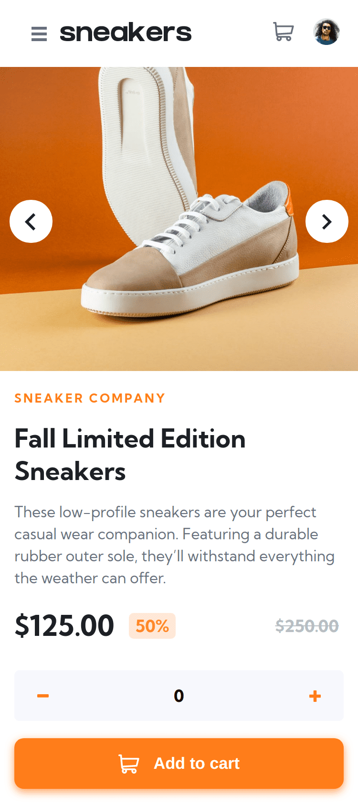
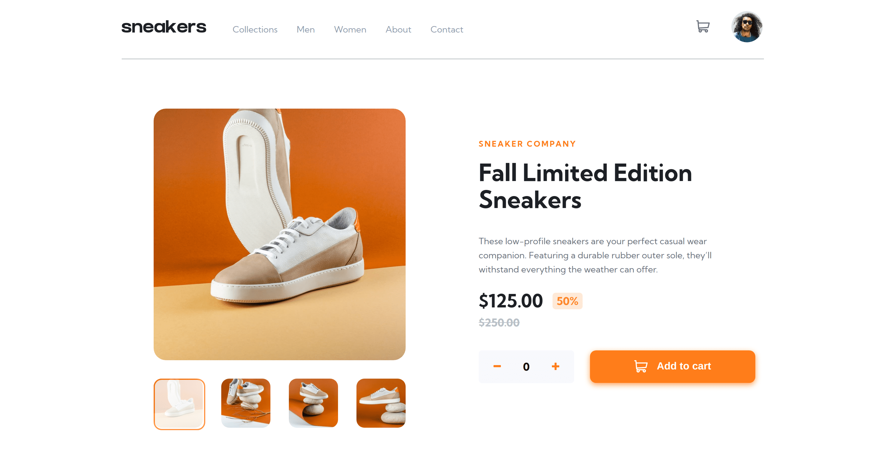

# Ecommerce-product-page

# Frontend Mentor - E-commerce product page solution - Rufi512

## Table of contents

- [Overview](#overview)
  - [The challenge](#the-challenge)
  - [Screenshots](#screenshots)
- [My process](#my-process)
  - [Built with](#built-with)
- [Author](#author)

## Overview

### The challenge 

Users should be able to:

- View the optimal layout for the site depending on their device's screen size
- See hover states for all interactive elements on the page
- Open a lightbox gallery by clicking on the large product image
- Switch the large product image by clicking on the small thumbnail images
- Add items to the cart
- View the cart and remove items from it

### Screenshots

(**375px** - **1440px**) Width

| Mobile Design | Mobile Solution | 
|--|--|
|  |  |

| Desktop Design | Desktop Solution  | 
|--|--|
|   |   |

## My Process

### Built with

 - VueJS
 - SASS

## Author

- Frontend Mentor - [@Rufi512](https://www.frontendmentor.io/profile/Rufi512)
- Twitter - [@Rufi512](https://twitter.com/rufi512)
